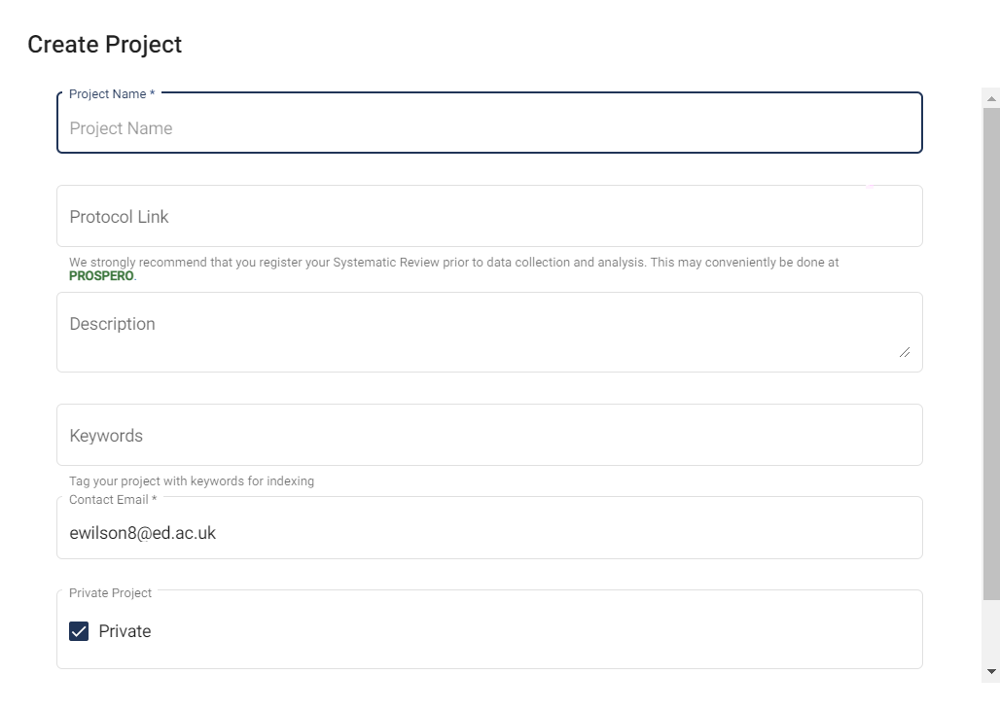

# Create a New Project {#createProject}

You can create new projects via the Projects tab. Enter your project details in the pop-up form that appears.

As part of project creation, you will be asked to specify the inclusion/exclusion criteria for your project. These should be pre-specified in your protocol.

{#id .class width=100% height=100%}

Once you have created your project, you can keep track of your project progress through the Project Details Page on the right-hand side of your screen.

You will automatically be assigned a Project Administrator role in any project that you create.

## Projects with multiple screening criteria

Currently, you can only have one set of inclusion/exclusion critiera per SyRF project. If you wish to have multiple screening stages in your systematic review, for instance title and abstract screening followed by full-text screening, you can do this by exporting your included studies from SyRF following your first screening stage and uploading them to a new SyRF project to complete your second screening stage.

[Contact us](mailto:syrf.info@ed.ac.uk) for a link to a Shiny App which will allow you to export your data.

