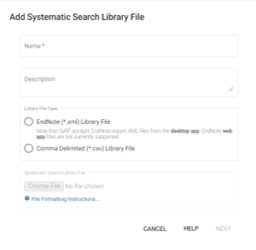

# Uploading a Systematic Search {#systematicSearch}

## Deduplicating your systematic search
If you have searched for studies using multiple databases there will be duplicate studies in your systematic search. Currently SyRF does not support deduplication of studies, and this must be performed before your studies are uploaded to SyRF. You can deduplicate your studies automatically using the [CAMARADES deduplication tool](https://camarades.shinyapps.io/RDedup/).

## Uploading files

	
A Project Administrator can upload a systematic search to your project by Selecting Systematic Searches from Project Settings and clicking "Upload New Systematic Search"
	
You can upload your systematic searches as an:

* EndNote XML file
* Comma separated value (CSV) file
* Tab separated value (TSV) file

SyRF currently accepts EndNote Desktop XML files. EndNote Web XML files are not supported.

{#id .class width=100% height=100%}

### Uploading your studies from an EndNote export

1. Highlight (Ctrl+A) all references all the references in yourEndNote library that you wish to upload to SyRF
2. Click File -> Export (NB: if you do not highlight all references only the first reference on your list will be exported)
3. Change the file type to XML
4. Name and save your XML file, which is now ready to be uploaded to SyRF

Please note that upload of studies with screening decisions is currently not supported with EndNote file uploads. If you have screening decisions for the studies you wish to upload, please use a CSV or TSV format instead.

#### Uploading from a Zotero export
Please note that you cannot use the  'EndNote XML' export option in Zotero to upload an EndNote file to SyRF. If you are using Zotero to manage your study references, please export as a CSV file and follow the CSV upload instructions.

[**I am trying to upload an EndNote XML file that was created by importing from a place other than an electronic database and getting an error.**](https://syrf.org.uk/faq)
I am trying to upload an EndNote XML file that was created by importing from a place other than an electronic database and getting an error.

### Uploading your studies as a CSV or TSV
To upload your systematic search studies as a CSV or TSV file, you will have to make sure to format your data with following the column headings to make the upload work:
* Title
* Authors
* Publication Name
* Alternate Name
* Abstract
* Url
* Author Address
* Year
* DOI
* Keywords
* Reference Type
* PDF Relative Path

You can download a template with the [correct column headings and example data here.](https://syrf-test.co.uk/assets/pdfs/Systematic_search_instructions.html)

Even if you don't have information for all the columns specified, they will need to be in your file in order to make the upload work. SyRF will accept empty fields for any of these variables. Note that the Year column cannot contain non-numeric characters, if the year of publication is not known then leave the field blank.

Files must first be saved as either Text - Tab delimited (\*.txt) or CSV - Comma delimited (\*.csv) files. This can be done in excel using the ‘Save as type:’ dropdown control in the ‘Save As’ dialog. 

#### Upload studies with screening decisions
You can  upload screening decisions made outside of SyRF if you are uploading your systematic search as a \*.csv or \*.txt file.  

To do so you should add separate columns for each user and screening decisions should be represented with the value 1 for inclusion and 0 for exclusion.  

SyRF’s upload wizard will allow you to select which column headers in your file correspond to which project member’s screening decisions. Please note that for SyRF requires 2 columns of screening decisions and, hence, at least 2 project members to assign those screening decisions to. If you only have 1 column of overall screening decisions then it is an option to duplicate this column and assign the columns to two project members. 

Your file should only contain the columns above and columns specified with screening decisions. If any columns are missing or additional columns are present the upload wizard will fail.

## Uploading full-text PDFs
If you require full-text PDFs for each of your studies at any stage of your SyRF project, it is important that you have already retrieved these full-text PDFs before uploading your search file.

In the systematic search file that you upload (csv/tsv spreadsheet or XML from Endnote) make sure the column “PDF Relative Path” contains relative path links (i.e. relative to the root of the folder you send to us) to your PDFs for each record.

You will then need to [contact us](syrf.info@ed.ac.uk) with the name of your project, a folder containing your PDFs (sent via Google Drive or similar) and a CSV file containing the file path to each PDF and the title or SyRF study ID of each study, so we can match PDFs with your studies in SyRF. 

We will upload these PDFs to the SyRF database and these can be opened from the screening form.

### PDF file names
Please avoid using invalid characters (e.g. , < > : " \\ / | ? \*) in file names as it may cause issues. By default, software like EndNote uses Author and Title information to name files, which can cause invalid characters to be added to your PDF file names. You can change the default to name PDFs using another column such as RecordID. Whichever columns you chose to name your PDFs with, the data should be unique.

 
[**I am performing a two-stage screening process and need to add PDFs only for my included studies for full-text screening**](https://syrf.org.uk/faq)

## View project studies
You can now view project studies by clicking on the ‘Studies’ then 'All Studies' on the left hand side navigation panel. This will show you all the studies you have uploaded to your project.

## Deleting systematic searches
If you need to delete your systematic search, you can do so In SyRF. Be aware, however, that if you have used SyRF to screen or annotate these studies, deleting your systematic search will also delete these screening decisions and annotation answers.
