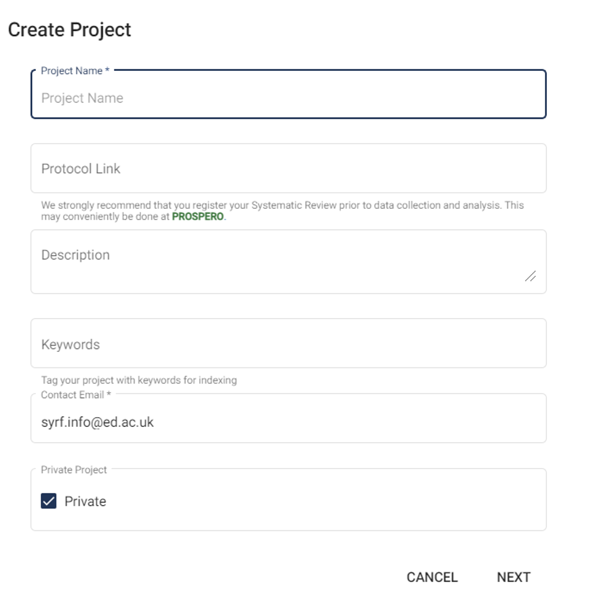
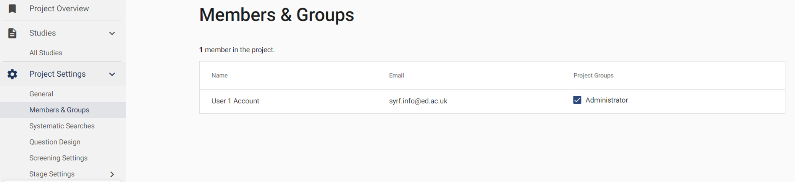
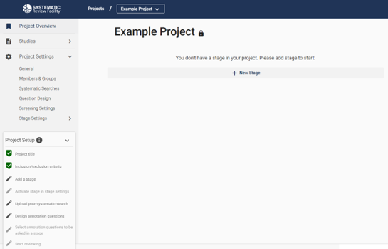
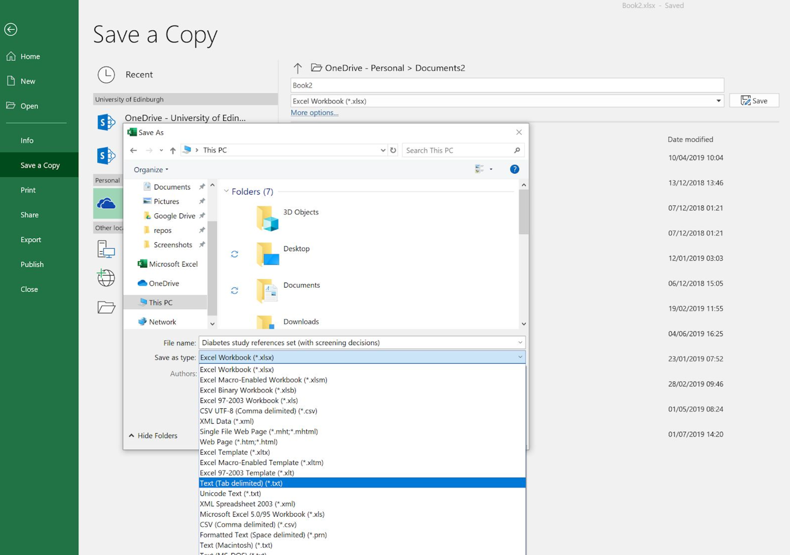
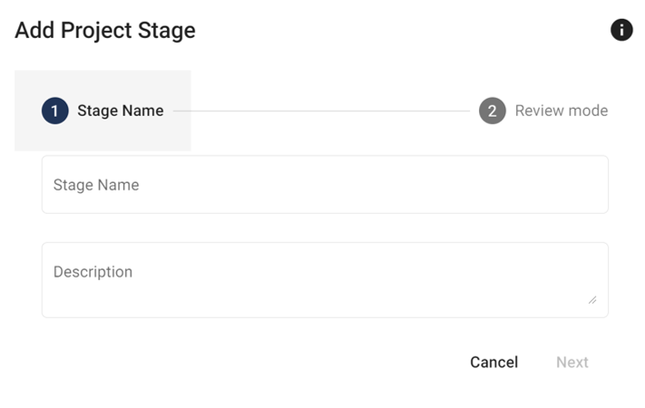
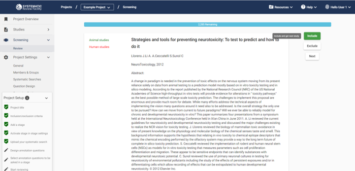

--- 
title: "SyRF User Guide"
author: "CAMARADES"
date: "`r format(Sys.Date(), format = '%d %b %Y')`"
site: bookdown::bookdown_site
documentclass: book
bibliography: [book.bib, packages.bib]
link-citations: yes
---

<!--chapter:end:index.Rmd-->

# Getting Started {#index}

Welcome to the SyRF User Guide. This guide is designed to help you use SyRF. If you require general guidance on systematic review or meta-analysis, or have never conducted a systematic review before, please read the [Systematic Review Wiki](https://www.camarades.de/) created by CAMARADES Berlin.

## Glossary
### Project
Each project is specific to your systematic review and meta-analysis. Upload your deduplicated studies and add stages to screen and annotate your data.

#### Public project
A project that can be seen by anyone with a SyRF account. In the current version of SyRF, other users can request to join a public project and can join without any requirement for approval from project owners.

#### Private project
A project that is only visible to SyRF users that are members of the project.

### Protocol
A structured description of what you set out to do in your systematic review and meta-analysis, which should be finalised before you start your systematic review. We recommend that this is published or shared publicly with [PROSPERO](https://www.crd.york.ac.uk/prospero/).

### Screening
Screening refers to making a decision whether to include or exclude a study retrieved in your systematic search based on the inclusion/exclusion criteria defined in your protocol. Screening is described in more detail in [Section 9](https://camaradesuk.github.io/syrf_userguide/projectscreening.html).

### Annotation
You may want to annotate your studies by labelling or extracting relevant information from them. This part of a systematic review project is fairly flexible and therefore you can define your own annotation questions. Annotation questions should address all questions you want to ask as specified in your protocol. You can choose at which stage of the project you want to answer specific annotation questions. This is described in more detail in [Section 10](https://camaradesuk.github.io/syrf_userguide/projectannotation.html).

### Data extraction
Where you extract data from graphs or tables in the form of means/medians and corresponding error.

### Experiment
An experiment refers to any grouping of cohorts where an experiment is carried out at the same time and any of them can be compared with each other.

### Cohort
A cohort refers to a group of animals - same species, strain, source, co-morbidities (if applicable) - which all receive the same procedure and treatments and can be compared to other cohorts. For example, an experiment may involve the following cohorts: 

Example Experiment 1:

* Cohort 1: Treatment (Disease Model + Treatment)
* Cohort 2: Sham
* Cohort 3: Control (Disease Model + Vehicle)

Example Experiment 2:

* Cohort 1: Control (Disease Model + Vehicle)
* Cohort 2: Treatment 1 (Disease Model + Treatment 1)
* Cohort 3: Treatment 2 (Disease Model + Treatment 2)

Cohorts are created in SyRF projects by combining disease models and treatment details. 
(https://camaradesuk.github.io/syrf_userguide/projectannotation.html).

<!--chapter:end:01-index.Rmd-->

# Create an Account {#createAccount}

You will need to create a free account to create or participate in projects.

[To Create a new SyRF account, click here.](https://syrf.org.uk)

Creating an account allows us to keep your data secure and allows the administrator of each project to see who has access to the project data. Read our [Data Management and Sharing Policy here](https://auth.syrf.org.uk/Privacy).

 
[**I don’t see an email in my inbox from SyRF**](https://syrf.org.uk/faq)

Once you have created an account and logged in you can access public projects or create a new project via the Projects tab in SyRF.

<!--chapter:end:02-createAccount.Rmd-->

# Join a Project {#join}

The Projects tab in SyRF will show all the projects you are a member of, as well as all public projects. 

To join a project, you will need to click ‘Request to join’ on the project’s homepage. In the current version of SyRF, all users who request to join a project will be automatically assigned access and the Reviewer role in the project.

{#id .class width=100% height=100%}

If you do not wish other users to join your project, it is best to set your project to Private.

 

[**My collaborators can’t see my project**](https://syrf.org.uk/faq)

<!--chapter:end:03-join.Rmd-->

# Create a New Project {#createProject}

You can create new projects via the Projects tab. Enter your project details in the pop-up form that appears.

As part of project creation, you will be asked to specify the inclusion/exclusion criteria for your project. These should be pre-specified in your protocol.

{#id .class width=100% height=100%}

Once you have created your project, you can keep track of your project progress through the Project Details Page on the right-hand side of your screen.

You will automatically be assigned a Project Administrator role in any project that you create.

## Projects with multiple screening criteria

Currently, you can only have one set of inclusion/exclusion critiera per SyRF project. If you wish to have multiple screening stages in your systematic review, for instance title and abstract screening followed by full-text screening, you can do this by exporting your included studies from SyRF following your first screening stage and uploading them to a new SyRF project to complete your second screening stage.

[Contact us](mailto:syrf.info@ed.ac.uk) for a link to a Shiny App which will allow you to export your data.

<!--chapter:end:04-createProject.Rmd-->

# SyRF user Roles {#roles}

There are two user roles in SyRF: Project Administrator (admin) and Reviewer. These roles are project specific - you may be a Project Administrator in some of your projects and a Reviewer in others.

You will automatically be assigned a Project Administrator role in any project that you create. Project Administrators can edit projects. 

SyRF users that request to join a project will automatically be assigned a Reviewer role. Reviewers can screen or annotate studies in the project.

## Changing a user role
When users join a project, they will automatically be assigned the Reviewer role.

Only Project Administrators can change user roles.  In the list of members in your project, you can assign other members to be Project Administrators by selecting the Administrator check box.

{#id .class width=100% height=100%}

If you are assigned a Reviewer role and think you should be a Project Administrator instead, please contact one of the other Project Administrators on the project to change this for you.

<!--chapter:end:05-roles.Rmd-->

# Project Navigation {#nagivation}

{#id .class width=100% height=100%}

## Project Overview 
When in Project Overview you can expand the description of each stage to see what progress has been made in screening and annotation of that specific stage.

## Project details
You can see an overview of the project on the Project Details page. 

In the centre of the page, you will see a screening stage with the inclusion and exclusion criteria that were added by the Project Administrator during project creation. Click the 'Review' button to enter a stage. If you are a Project Administrator, you will be able to add new stages there too. 

On the right hand side of the Project Overview page you can see:

* Contact - the contact email of the project administrator
* Protocol url - a link to where the systematic review protocol has been published
* Keywords - any keywords assigned to the project
* Systematic searches - details of studies added to the project
* Project visibility - either public or private
* Creation date - the date the project was made
* Members - a list of members on the project

Project Details can be edited by clicking on the cog icons next to each heading.

## Studies
You can see the details of all the studies you have uploaded to SyRF in the studies tab. To learn how to upload studies or systematic searches, please go to [Section 7](https://camaradesuk.github.io/syrf_userguide/systematicSearch.html).

## Stages
You can start screening or annotating in a stage by clicking on the stage name  (on the left-hand side navigation pane) and then 'Review'. Note that if the Project Administrator has not uploaded any systematic searches, you will not be able to under a stage.

## Project settings
Only Project Administators are able to edit project settings.

### General settings
In the general project settings, Project Administrators can edit:

* Project name
* Project description
* Project visibility
* Contact email
* Protocol Url
* Keywords

#### Deleting projects
Projects can be deleted from the general settings. Please know that data from deleted projects cannot be recovered.

### Members & groups
Project Administrators can change user roles in the members & groups settings page. To make a user a Project Administrator, click the checkbox next to their name. Uncheck the box to make them a Reviewer. Changes are saved automatically.

### Systematic searches
Project Administrators can view the systematic searches that have previously been uploaded, or upload new systematic searches on this page. For more information, go to [Section 7](https://camaradesuk.github.io/syrf_userguide/systematicSearch.html).

### Question design
Project Administrators can add and delete annotation questions in their project on this page. These questions can be then assigned to annotation stages. For more information, go to [Section 10](https://camaradesuk.github.io/syrf_userguide/projectannotation.html).

### Stage settings
In the stage settings, Project Administrators can add and edit stages.

You can decide which elements to add to your stage, e.g. screening, annotation and/or data extraction. If you choose both screening and annotation, you will be asked to choose how to combine these tasks. Specifically, the options are:
	- All studies require screening, but annotation is optional
	- All studies require annotation, but screening is optional
	- All studies require both screening and annotation
	

#### Annotation question selection
Project Administators can select which questions they have created in the Question Design settings page to add to each stage. Click the 'Edit project questions' button to return to the question design page.

<!--chapter:end:06-nagivation.Rmd-->

# Uploading a Systematic Search {#systematicSearch}

## Deduplicating your systematic search
If you have searched for studies using multiple databases there will be duplicate studies in your systematic search. Currently SyRF does not support deduplication of studies, and this must be performed before your studies are uploaded to SyRF. You can deduplicate your studies automatically using the [CAMARADES deduplication tool](https://camarades.shinyapps.io/RDedup/).

## Uploading files

	
A Project Administrator can upload a systematic search to your project by Selecting Systematic Searches from Project Settings and clicking "Upload New Systematic Search".
	
You can upload your systematic searches as an:

* EndNote XML file
* Comma separated value (CSV) file

SyRF currently accepts EndNote Desktop XML files. EndNote Web XML files are not supported.

{#id .class width=100% height=100%}

### Using EndNote (as XML)
*Without screening decisions (screening upload not currently supported)*

1. Import all references to be screened into EndNote 
2. Find the full text PDFs by highlighting all your references (`Ctrl`+`A`) and click References -> Find Full Text
3. Highlight (`Ctrl`+`A`) all references and click File -> Export (NB: if you do not highlight all references only the first reference on your list will be exported) 
4. Change the file type to XML 
5. Name and save your XML file, which is now ready to be uploaded to the SyRF screening database

#### Uploading from a Zotero export
Please note that you cannot use the  'EndNote XML' export option in Zotero to upload an EndNote file to SyRF. If you are using Zotero to manage your study references, please export as a CSV file and follow the CSV upload instructions.

[**I am trying to upload an EndNote XML file that was created by importing from a place other than an electronic database and getting an error.**](https://syrf.org.uk/faq)
I am trying to upload an EndNote XML file that was created by importing from a place other than an electronic database and getting an error.

### Spreadsheet (\*.csv supported)
*Optionally including screening decisions*

1. You can upload study references as a systematic search from a spreadsheet (e.g. Microsoft Excel Document)  
2. You will have to make sure your file has the following column headings to make the upload work: 
    * Title
    * Authors
    * Publication Name
    * Alternate Name
    * Abstract
    * Url
    * Author Address
    * Year
    * DOI
    * Reference Type
    * Keywords
    * PDF Relative Path

You can download a template with the [correct column headings and example data here.](https://syrf-test.co.uk/assets/pdfs/Systematic_search_instructions.html) 

3. Even if you don't have information for all the columns specified, **they will need to be in your file** in order to make the upload work. SyRF will accept empty fields for any of these variables.
4. If you would like to upload **screening decisions** already made outside of SyRF along with list of studies, you should **add separate columns for each user** and SyRF’s wizard will allow you to select which column headers in your file correspond to project members.
5. Within screening columns decisions should be represented with the value **1 for inclusion and 0 for exclusion**.
6. Your file should **only** contain the columns above and columns specified with screening decisions. If any columns are missing or additional columns are added (not specified for screening) the upload wizard will fail. 
7. Files must first be saved as CSV - Comma delimited (\*.csv) files. This can be done in excel using the Save as type: dropdown control in the Save As dialog. 

{#id .class width=100% height=100%}

## Uploading full-text PDFs
If you require full-text PDFs for each of your studies at any stage of your SyRF project, it is important that you have already retrieved these full-text PDFs before uploading your search file.

In the systematic search file that you upload (csv/tsv spreadsheet or XML from Endnote) make sure the column “PDF Relative Path” contains relative path links (i.e. relative to the root of the folder you send to us) to your PDFs for each record.

You will then need to [contact us](syrf.info@ed.ac.uk) with the name of your project, a folder containing your PDFs (sent via Google Drive or similar) and a CSV file containing the file path to each PDF and the title or SyRF study ID of each study, so we can match PDFs with your studies in SyRF. 

We will upload these PDFs to the SyRF database and these can be opened from the screening form.

### PDF file names
Please avoid using invalid characters (e.g. , < > : " \\ / | ? \*) in file names as it may cause issues. By default, software like EndNote uses Author and Title information to name files, which can cause invalid characters to be added to your PDF file names. You can change the default to name PDFs using another column such as RecordID. Whichever columns you chose to name your PDFs with, the data should be unique.

 
[**I am performing a two-stage screening process and need to add PDFs only for my included studies for full-text screening**](https://syrf.org.uk/faq)

## View project studies
You can now view project studies by clicking on the ‘Studies’ then 'All Studies' on the left hand side navigation panel. This will show you all the studies you have uploaded to your project.

## Deleting systematic searches
If you need to delete your systematic search, you can do so In SyRF. Be aware, however, that if you have used SyRF to screen or annotate these studies, deleting your systematic search will also delete these screening decisions and annotation answers.

<!--chapter:end:07-systematicSearch.Rmd-->

# Project Stages {#projectstages}

## What are stages?
Stages are sections of your SyRF projects that you add to perform tasks such as screening and data annotation. You can have screening and annotation as separate stages and you can also have screening and annotation in the same stage.

## Add a stage
You can add a stage via the left-hand side nagivation bar in your SyRF project or by clicking "add stage" on the project overview page.

{#id .class width=100% height=100%}

Once you have added a stage, you can include it in your project by changing the setting to "Active" in the top right-hand corner of the stage page.

## Stage with screening
By adding screening to your stage, you can screen the studies you have uploaded to your SyRF project using the inclusion/exclusion criteria you entered when creating your project. Currently, as inclusion/exclusion criteria are defined at the project level, you can only screen according to one set of inclusion/exclusion criteria.

## Stage with annotation
A stage with annotation allows you to annotate data from your study, according to pre-defined questions in your systematic review protocol. SyRF has a question builder tool to allow you to design questions for your project.

Once you have designed all annotation questions, you should specify the stage at which you want to answer each question. You can do this before you start screening or after you have finished screening.

To add questions to your stage of interest go to the ‘Stages’ section of your project homepage and click ‘Enter Stage’. You will then need to click on ‘Stage Design’ to start editing the stage.

### Data extraction
To extract data from graphs in your systematic review studies, you will have to turn on data extraction in addition to annotation within your stage.

## Screening and annotating within the same stage
If you want to carry out screening and annotation at the same time, you will also need to have these functionalities turned on (e.g. even if you have screened at a separate stage, you might want to have the functionality of being able to exclude a study at a later time point when you have read the full-text).

You will then be able to select the questions that you want to be included in this stage by checking the box next to the relevant questions.

<!--chapter:end:08-projectstages.Rmd-->

# Screening {#projectscreening}

## Screening using SyRF
You can screen the studies in your SyRF project against the inclusion/exclusion criteria you defined in your systematic review protocol and that you specified when you created your project by creating a screening stage in SyRF.

When you start reviewing in a stage with screening enabled, you will be shown the title and abstract of a random study from your systematic search uploads. If you have also uploaded PDFs, there will be a button to allow you to view the PDF.

Use the include and exclude buttons to record whether or not your study meets the inclusion/exclusion critiera. If you are unsure and want to come back to the study, click 'Next' to skip it and move on to another study.

{#id .class width=100% height=100%}

Once you have decided to include or exclude a study, SyRF will record it as completed by you and you will not be shown it again. If you think you have made a mistake, it is possible to click the back button on your browser to go back to your previous study and re-screen it.

### Studies unavailable to screen
You will not be presented with studies that have been sufficently screened by other reviewers on the project. Instead, you can see how many studies have been sufficiently screened by other reviewers on your progress bar within the screening stage, marked as 'Unavailable'. Information on how to configure the number of reviewers required to sufficently screen each study can be found in the 'Number of Screeners' section below.

## Number of screeners
By default, SyRF expects each study to be screened by two indepentent reviewers, with disagreements reconciled by a third reviewer, meaning you need at least three people to screen on your project. SyRF will check which studies have to be reconciled and they will become automatically available to a third person on the project.

If you are doing a student project and don't have other screeners, you can configure your stage to allow single screening in the Stage Settings. This is only recommended for student projects, and not for systematic reviews which you plan on publishing in a scientific journal.

If you wish to manually reconcile your screening disagreements, you can also configure this in the Stage Settings. Please note that this option is not recommended and you will have to contact our Help Desk to help you access your data for manual reconciliation.

 
**My project only has two screeners, how can I see screening decisions?**
[Check out the FAQ](https://syrf.org.uk/faq)

<!--chapter:end:09-projectscreening.Rmd-->

# Annotation Questions {#projectannotation}

## Creating annotation questions
In your systematic review protocol, you will have specified certain information you want to extract from each of your studies, such as 'Were animals randomised to experimental groups?' or 'What concentration of drug treatment was used?'. In SyRF you can annotate your studies with this information using annotation questions.

To design annotation questions for a stage of your project, go to 'Question Design' under 'Project Settings' on the left-hand navigation bar of your project.

{#id .class width=100% height=100%}

### Question editing
At present, questions can only be added or deleted. Individual questions cannot be edited or changed order. This is primarility due to our database structure and questions and an editing feature will be implemented in an upcoming release.

## Question categories
Annotation questions are entered into the following categories depending on what information they ask about:

## Question categories
### Study level questions
Enter any question that is relevant to the overall study. 

e.g. Do the authors provide a study protocol that is available to you?
(Yes or No checkbox)

### Disease Model Induction questions
When adding a question you will be required to select whether the question relates to Control animals, Non-control animals (model animals) or both. 

#### Control Question
Define questions that are specific to the Model control.

e.g. Do the control animals receive Sham surgery?
(Yes or No checkbox)

#### Non-Control Question
Define questions that are specific to the Model

e.g. What type of surgery was carried out to induce the model?
(Dropdown list with defined options)

#### Both
Define questions that are relevant to both Model control and Model animals

e.g. What anaesthetic was used for both the model and sham surgery?
(Dropdown list with defined options)

### Treatment questions
When adding a question you will be required to select whether questions related to Control animals, Non-control animals (treatment group animals) or both.

#### Control question
Define questions that are specific to the Treatment control

e.g. What is the vehicle given to the control animals? 
(Dropdown list with defined options)

#### Non-Control question
Define questions that are specific to the Treatment group

e.g. Specify the dose of treatment drug given in mg/kg
(Decimal input box)

#### Both
Define questions that are relevant to both Treatment control and Treatment animals

e.g. What route of drug or vehicle administration is used in the experiment?
(Dropdown list with defined options)

### Outcome assessment questions
Define questions relevant to each outcome assessment procedure in the study.

e.g. What is the behavioural test used to measure outcome?
(Dropdown list with defined options)

### Cohort level questions
Define questions relevant to each cohort (experimental group) in the study. 

e.g. What is the sex of the animals included in the cohort?
(Dropdown list with options males, females, both, unknown)

[I have cohorts with comorbidities and I'm not clear on how to differentiate between them.](https://syrf.org.uk/faq)

### Experiment questions
Define questions relevant to each experiment in the study

e.g. Was there a habituation period?
(Yes or No checkbox)

## Creating a new question
To add a question, simply click the '+' button next to the category you want to design a question in.

When adding a question, you can enter the following details:

1. The name of your question
2. A description of the question, which will be displayed alongside your question in SyRF
3. Whether the question accepts only a single answer or multiple answers
4. Whether the question is optional or required
5. The type of answer the question accepts (e.g. text, integers, decimals)
6. The question type (e.g. dropdown list, checkbox)

{#id .class width=100% height=100%}

### Question types
There are 6 question types in SyRF:

* Dropdown lists
* Autocomplete lists
* Radio buttons
* Checklists
* Check boxes
* Input boxes

We recommend that when using checklists or check boxes, you set the default checkbox status to 'indeterminate'.

### Allowing multiple answers
If you choose to allow multiple answers, you will be asked if you want these to be split into separate annotations. This refers to how the data will be presented in your output data file.

Choosing to split multiple answers into separate annotations means that, in your output file, the multiple answers will be separated into different rows. Choosing not to split into separate annotations, means that they will appear in the same row, separated by a semi-colon. 

If you have nested questions, it may be best to choose to split your answers into separate annotations so that the nesting displays properly in your output file. For example, in an 'Outcome Assessment' category question asking 'What behavioural tests are used?', we would allow multiple answers and may choose to split into separate annotations' as this allows us to ask further related questions to the specific behavioural test.

### Nesting questions and conditional questions
Questions may be nested to allow for hierarchy of conditional information entry (i.e. questions can become active, depending on answers to previous questions). 

For each question you can choose to add related questions, if you want to get answers to additional questions, which are conditional on the answerto the previous question.

e.g. “What type of model is used?”
(Drop down list with option of: Pharmacological or Surgical)

We could then add a related question by selecting “Add Related”, and in the form "conditionally display based on parent question".

e.g. “What is the drug given?”
(Drop down list with options of different drugs)

You could then ask further related questions, by clicking on this question and selecting ‘Add Related’ and asking for each drug selected: “What is the dose and route of delivery?” If Surgical is selected then we may ask the related questions: “What was the anaesthetic used?” or “What was the site of lesion?”.

These questions will nest under the previous question.

## Adding questions to stages
Once you have designed your questions, to allow them to be presented to reviwers, you need to add them to your annotation stage by going to 'Stage Settings' then the name of the stage of want to add your questions to and selecting the questions you want to add to the stage.

<!--chapter:end:10-projectannotation.Rmd-->

# About us {#about}

## CAMARADES
Since 2005, the Collaborative Approach to Meta-Analysis and Review of Animal Data from Experimental Studies (CAMARADES; [CAMARADES website](https://www.ed.ac.uk/clinical-brain-sciences/research/camarades)) group have provided training and mentoring to those wishing to conduct systematic reviews and meta-analyses of data from preclinical studies. 

##SyRF
The Systematic Review Facility (SyRF) was developed by CAMARADES with initial funding from the UK National Centre for the Replacement, Refinement and Reduction of Animals in Research (NC3Rs) to support the application of evidence synthesis techniques to preclinical research. SyRF is a freely available, online platform to extract and store data for systematic reviews of preclinical studies and provides educational resources and guidance on preclinical systematic reviews. SyRF enables researchers to collaborate easily, to efficiently manage projects, to screen and annotate studies for important features, to extract outcome data, and tailor these steps to each project. SyRF has been released with minimum features and continuous development will be required to add functionality guided by user demand and feedback. We [welcome any feedback](mailto:syrf.info@ed.ac.uk).

<!--chapter:end:11-about.Rmd-->

# FAQ

If you have a question related to SyRF that is not covered by this user guide, please check our frequently asked questions page on the SyRF website.

[Find the FAQs here: https://syrf.org.uk/faq](https://syrf.org.uk/faq)

<!--chapter:end:12-faq.Rmd-->

